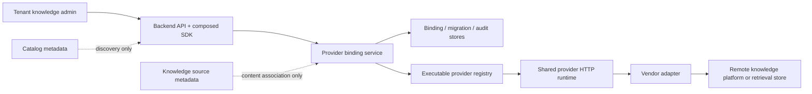

# ADR-20260720 Knowledge Engine Provider Binding And SPI v2

Status: accepted  
Requirement: REQ-2026-0720  
Owner: SDKWork Knowledgebase maintainers  
Date: 2026-07-20  
Specs: ARCHITECTURE_DECISION_SPEC.md, API_SPEC.md, SDK_SPEC.md, DATABASE_SPEC.md,
MIGRATION_SPEC.md, SECURITY_SPEC.md, PRIVACY_SPEC.md, OBSERVABILITY_SPEC.md, TEST_SPEC.md

## Context

Before this decision, the SPI gave every implementation the same five methods while real
integrations had different semantics. Knowledge platforms can retrieve and read remote documents;
vector stores can retrieve points or objects but do not necessarily enumerate business documents;
frameworks may be catalog references only. Provider selection was inferred from connector sources,
the registry erased external lifecycle extensions, and requests did not carry the authenticated
actor, data scope, deadline, or credential reference required for a tenant-safe commercial boundary.

Catalog/capability truth, native-mode precedence, ambiguous external selection, external health,
and duplicate registration are already corrected under REQ-2026-0720. The data, public API,
credential, component, and migration decisions in this record were accepted by the application
owner on 2026-07-20 before their implementation began.

## Decision

1. Provider identity and capability are separate. `implementationId` identifies code; a persisted
   binding identifies a tenant/space configuration; a capability snapshot records what that binding
   proved at its last successful test. Unsupported operations return typed errors and are never
   synthesized from collection, class, pipeline, or catalog metadata.
2. Providers are classified as native knowledge engines, external knowledge-platform adapters,
   retrieval-infrastructure adapters, or catalog-only frameworks. Category never implies a method.
3. `kb_provider_binding` becomes the sole external selection authority. It is
   scoped by tenant, organization, and space; references one implementation and one remote resource;
   holds no plaintext secret; and uses optimistic versioning plus lifecycle state. `kb_source`
   remains content/source metadata and cannot choose an engine.
4. SPI v2 operations accept an immutable execution context containing tenant, organization, actor,
   permission/data scope, space, binding, trace, and deadline. Authorization and scope validation
   happen before credential resolution and network access.
5. The core registry preserves typed capability/lifecycle handles instead of erasing the external
   extension. Registration is unique and deterministic. Catalog-only entries remain discoverable
   metadata outside the executable registry unless they ship an approved adapter.
6. Optional operations are capability-gated: probe, search, read, list, ingest, and sync. Activation
   requires a successful probe and a compatible capability snapshot. Capability loss degrades the
   binding and blocks incompatible commands.
7. A repository-owned `sdkwork-knowledgebase-provider-runtime` crate owns connection
   pooling, connect/request deadlines, cancellation, bounded idempotent retries with jitter,
   `429`/`Retry-After`, circuit breaking, concurrency bulkheads, response byte limits, trace
   propagation, metrics, and redaction. All vendor adapter crates depend on that runtime; the
   runtime never depends on an adapter. Adapter crates own only vendor URL, authentication scheme,
   wire DTOs, and mapping.
8. Provider errors use a stable category, operation, implementation/binding identity, retryable
   flag, optional retry-after, safe detail, and source chain. Secrets, raw auth headers, and
   unbounded upstream bodies are never included.
9. Binding lifecycle is `draft -> testing -> active`, with `degraded`, `disabled`, and `failed`
   operational states. Migration is a separate checkpointed operation with dry-run, prepare,
   validate, cutover, observe, complete, rollback, and failed states. Cutover is an atomic binding
   switch; old bindings and remote data are retained through the rollback window.
10. Backend API is the management authority and uses SDKWork v3 command/async patterns. Apps consume
    only generated composed SDKs. Test output is sanitized; credential material is write-only by
    reference. Every mutation requires admin permission, idempotency, version checks, and audit.
11. Adapter tier means executable and contract-tested, not commercially certified. Production tier
    additionally requires pinned upstream versions, live certification, licensing approval, SLO,
    runbook, security/privacy assessment, and release evidence.

## Architecture Views

Dependency direction is API -> application service -> ports -> repository/provider adapters.
Handlers never call vendor HTTP, registries never infer authority from source order, and adapters
never access persistence or credentials outside approved ports.

### Existing Foundation Assessment

- `sdkwork-utils-rust` provides generic HTTP contract helpers but no outbound client timeout,
  retry, circuit-breaker, bulkhead, or bounded-body runtime.
- ClawRouter's `sdkwork-claw-provider-adapter-http` is a useful reference for HTTPS target policy,
  connection/request timeouts, pooling, bounded response collection, and safe error previews. It is
  coupled to ClawRouter invocation manifests, route configuration, gateway authentication, and
  security types, so Knowledgebase must not create a reverse domain dependency on it.
- `sdkwork-knowledgebase-observability` exports request, audit, billing, and OKF metrics but has no
  provider/operation/result/latency dimensions. The provider runtime will expose bounded-cardinality
  recording functions through this existing observability owner rather than embedding metrics in
  each vendor adapter.
- No existing approved workspace component provides the complete required boundary. The runtime
  crate is therefore an application-owned component with the dependency direction defined here.

## Alternatives

1. Keep inferring a provider from connector sources: rejected because multiple sources are valid
   content associations and cannot provide deterministic lifecycle, credential, or rollback state.
2. Add more required methods to the current trait: rejected because it increases false capability
   claims and continues to erase security context and optional behavior.
3. Use one generic JSON configuration/secret blob: rejected because it prevents field-level
   validation, rotation, redaction, audit, and least-privilege credential ownership.
4. Register catalog-only frameworks as executable stubs: rejected for SPI v2 because discovery
   metadata must not be mistaken for a runtime provider.
5. Switch bindings in place with no retained predecessor: rejected because failed cutovers could
   not be rolled back safely or audited.

## Consequences

- A database migration, authored OpenAPI changes, regenerated SDKs, backend management UI, worker
  operations, and provider certification harness are required.
- Existing source rows are never converted into Provider authority. Prelaunch external spaces with
  no active binding fail closed and require an administrator to create and test an explicit
  binding; no oldest/first-provider fallback, compatibility resolver, or dual-read path exists.
- Provider-specific capabilities remain honest, at the cost of some UI commands being unavailable.
- The shared runtime adds dependencies and state, but centralizes reliability and telemetry policy.
- Security/privacy review must approve the credential reference owner, egress/data-scope policy,
  audit payloads, provider data processing, and deletion/retention behavior.
- Acceptance authorizes the scoped schema, public naming, auth-context, credential-reference,
  generated SDK, and migration work in this decision. Production publication still requires the
  independent release evidence and governance gates defined by SDKWork standards.

## Implementation Status

As of 2026-07-20, the application resolves each space to a
`KnowledgeEngineExecutionHandle`. Search, read, and list validate immutable request-derived tenant,
organization, actor, permission, data scope, space, binding, trace, and deadline before engine
execution. The handle injects the persisted active Binding, resolves its current write-only
credential reference only after authorization, and passes a one-time
`KnowledgeEngineProviderCredential` to `bind_provider`. The secret type is non-serializable,
redacts `Debug`, and zeroizes its owned value on drop. The default resolver accepts validated
`env://UPPERCASE_VARIABLE` and bounded regular `file://` references and rejects unknown schemes
without echoing locators. Credential-reference create and rotate commands validate locator syntax
before persistence without loading the secret. There is no secret cache, so every authorized
operation observes the current reference and cannot serve a stale cached credential after rotation
or revocation.

All ten executable adapters revalidate request tenant/space through
`ProviderExecutionContext::from_knowledge_engine_request` before Provider Runtime HTTP and obtain
secrets only through the Binding boundary. Required-auth Providers fail closed without a credential
reference; Chroma, Qdrant, Weaviate, and Haystack preserve supported anonymous deployments.
Adapter startup config reads only non-secret endpoint/vendor settings. External sync requires an
explicit execution context. Aggregate backend health carries the authenticated Operator and trace,
and probes external Providers only through active Bindings; credential-free infrastructure probes
are the only permitted system-health context.

The backend management authority now exposes credential-reference create/list/retrieve/rotate/revoke
and space-scoped Binding create/list/retrieve/update/test/activate/disable operations. All operations
use `knowledge.platform.manage`, dual-token request context, bounded cursor pagination, optimistic
versions, resource-aware mutation audit, SDKWork v3 resource/list/command envelopes, and generated
TypeScript and Rust backend SDK methods. Audit events whitelist resource type/id, URL space scope,
expected/result version, and result status; they never serialize credential locators, fingerprints,
remote resource IDs, secret values, or raw request bodies. Missing authenticated Operators fail
closed instead of creating a synthetic audit actor. Credential read models omit locator and
fingerprint fields. Hosted runtime tests prove secret non-disclosure, path-space isolation,
stale-version conflict, rotation, revocation, and immediate fail-closed resolution after revocation.
Generated list methods return named `KnowledgeEngineProviderCredentialReferencePage` and
`KnowledgeEngineProviderBindingPage` models in both languages. The migration management authority
adds create/list/retrieve/rollback with `KnowledgeEngineProviderMigrationOperationPage`; repeated
generator dry-runs are idempotent with no destructive changes.

The migration Worker now claims one phase at a time with owner/token leases, fences stale claims,
revalidates source/target Binding scope, lifecycle, versions, and target capability evidence, and
persists checkpoints between dry-run, prepare, validate, cutover, observe, complete, rollback, and
failed states. Preparation explicitly means a pre-provisioned tested target; the Worker never
pretends to copy remote Provider data. Cutover and rollback atomically update both Bindings and the
operation. Observation work is not claimable before its deadline. Every phase persists a sanitized
service audit containing only tenant, space, operation ID, state transition, and result version.

Provider Certification v2 now separates local contract proof from live commercial proof. Contract
suite `1.0.0` executes the complete owned crate for all ten executable adapters and fingerprints the
capability, authentication, error-mapping, resilience, isolation, and health evidence sources. A
production promotion additionally requires a pinned upstream version and a current release evidence
index that binds the adapter commit, workflow run, reviewer, legal/security approvals, and SHA-256
digests for quality, contract, load/SLO, outage recovery, licensing, and security/privacy reports.
Quality evidence is accepted only for a reviewed `production-domain` dataset with minimum coverage,
two distinct reviewers, exact query/run cardinality, pinned release provenance, three independently
hashed artifacts, and metrics that match deterministic evaluator recomputation. Contract fixtures
are permanently classified as non-production.
The checked-in draft template is structurally unable to pass the certified-record validator. No
Provider has live evidence attached, so `liveCertifiedCount` remains zero.

The backend management UI is now implemented as a dedicated PC internal-admin Provider package with
composed backend SDK services, cursor pagination, capability/lifecycle guards, write-only locator
forms, permission boundaries, and sanitized states. This is not production completion. Production
secret-manager/KMS resolver and credential procedures, authenticated operator browser acceptance,
release PostgreSQL evidence, live Provider
certification, load/SLO evidence, supply-chain evidence, and rollout/rollback proof remain open
gates. Hosted Provider tests create explicit `draft -> testing -> active` Bindings; no production
path chooses a Provider from `kb_source`, registry order, task-local state, an adapter-created system
context, or startup credential availability.

## Migration And Rollback

Strategy: prelaunch `no-compatibility-approved` direct cleanup with forward-safe database rollback.

1. Add binding and migration storage through the canonical database lifecycle.
2. Produce a bounded report of prelaunch external spaces without an active Binding. This is now
   implemented as a tenant/organization-scoped SQL keyset read model plus a read-only Worker
   command. Its opaque cursor is bound to the requested scope, the result is secret-free, and the
   query never reads source rows. It never infers or synthesizes a Binding; an administrator
   explicitly creates, tests, and activates every required Binding.
3. Cut resolution directly to the active binding and remove source-order inference in the same
   prelaunch change. No deprecated resolver, feature flag, or dual-write path remains.
4. Provider-to-provider migration still uses prepare, validate, atomic cutover, observation, and
   rollback states; rollback reselects the retained predecessor and never deletes remote data.

The approved scope, compatibility decision, rollback, and verification commands are recorded in
`MIG-2026-0720-knowledge-engine-provider-binding.md`.

## Verification

- Static checks enforce catalog/runtime capability truth, unique registration, no direct adapter
  `reqwest::Client::new()`, no raw secret exposure, and generated SDK consumer boundaries.
- Unit/contract tests cover every capability and error category; integration tests cover binding
  scope, lifecycle, concurrency, audit, retries, circuit breaking, and response bounds.
- SQLite and PostgreSQL tests cover indexes, optimistic concurrency, tenant/RLS isolation,
  cutover, and rollback.
- Provider Binding readiness tests cover bounded SQL pagination, active/external filtering,
  tenant/organization isolation, non-active Binding reporting, opaque scope-bound cursors, and the
  prohibition on source-order inference. The optional PostgreSQL probe is strictly read-only.
- Live certification covers every production-tier provider and supported upstream version.
- Release gates require quality/load/outage/migration/rollback evidence and human architecture,
  security/privacy, data, SDK, and release review.

## Human Review

- [x] Provider/source ownership and `kb_provider_binding` aggregate accepted.
- [x] SPI v2 public Rust naming and prelaunch compatibility strategy accepted.
- [x] `sdkwork-knowledgebase-provider-runtime` ownership and dependency direction accepted.
- [x] Authored backend API operations and generated SDK surface accepted.
- [x] Credential reference owner, encryption/rotation, egress, and data-scope enforcement accepted.
- [x] Database migration/backfill/RLS/index and rollback plan accepted.
- [x] Licensing, production-tier certification, and release governance accepted as mandatory gates.

Review evidence: application owner explicitly accepted `ADR-20260720` on 2026-07-20.

## Supersedes / Superseded By

- Supersedes source-order Provider inference immediately in the approved prelaunch cutover.
- Superseded by: none.
