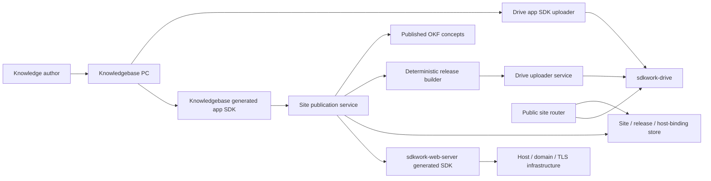

# ADR-20260721 Drive-Backed Knowledgebase Site Publication

Status: accepted  
Requirement: REQ-2026-0721  
Owner: SDKWork Knowledgebase maintainers  
Date: 2026-07-21  
Specs: ARCHITECTURE_DECISION_SPEC.md, API_SPEC.md, SDK_SPEC.md, DRIVE_SPEC.md,
DATABASE_SPEC.md, MIGRATION_SPEC.md, SECURITY_SPEC.md, DEPLOYMENT_SPEC.md, TEST_SPEC.md

## Context

The prelaunch implementation uploads some browser files through Drive but can bypass Drive for text
ingest, persists transient media URLs, and duplicates the Drive uploader lifecycle with
`upload_sessions`. Site deployment creates one escaped HTML preview, stores an object key in
Knowledgebase, and returns an object-gateway URL. It has no first-class site, immutable release,
public path resolver, SEO output, atomic activation, rollback, or cloud host lifecycle.

This is an ownership error, not a missing UI option. Drive must own binary lifecycle and storage
topology; Knowledgebase must own published content and release state; Web Server must own cloud
host, certificate, and reverse-proxy infrastructure.

## Decision

1. Browser binary upload uses `@sdkwork/drive-app-sdk client.uploader.*`. Server-generated website
   artifacts use `sdkwork-drive-uploader-service`. Knowledgebase persists stable Drive URI,
   `spaceId`, and `nodeId` only.
2. `upload_sessions` and the one-artifact `site_deployment` API/service/store are removed before
   launch. No compatibility alias, dual-write, object-key fallback, or historical namespace remains.
3. The domain model consists of `Site`, immutable `SiteRelease`, and `SiteHostBinding`. Site owns
   configuration and `currentReleaseId`; release owns the content snapshot and Drive manifest
   identity; host binding owns normalized routing identity and Web Server references.
4. Published input is a deterministic snapshot of `published` OKF concepts plus explicitly
   referenced public Drive assets. Raw sources, drafts, output internals, and governance files are
   excluded by construction.
5. Every release contains a manifest, one sanitized HTML page per concept, immutable assets, a
   search index, and sitemap. Artifacts are content-addressed and immutable. A database transaction
   activates a ready release; rollback selects another ready release without rebuilding.
6. `/wiki` is a delivery-only URL namespace. Internal operation IDs, Rust modules, persistence, and
   Drive paths use `sites`, `site_releases`, `site_host_bindings`, `releases`, and `okf`.
7. Standalone routes use `/wiki/{knowledgebaseId}/...`. Cloud routes use host resolution at
   `<knowledgebaseId>.kb.sdkwork.com` or a verified custom prefix/domain and root-relative page paths.
8. The numeric system binding always exists. A custom prefix can become canonical while the numeric
   host remains a redirect alias. External domains require Web Server domain verification and TLS.
9. Knowledgebase integrates with `sdkwork-web-server` through its generated app SDK/composed facade.
   Infrastructure changes occur only for site/host lifecycle, not for content-only releases.
10. Public delivery resolves only an active public or unlisted site with a ready current release.
    It normalizes host/path, rejects traversal, maps only manifest entries, applies a MIME allowlist,
    CSP and safe headers, and deliberately returns indistinguishable not-found responses.
11. Default publication is manual. Optional automatic publication subscribes only to
    `okf.concept.published` and uses the same idempotent release command.

## Architecture

Dependency direction remains HTTP adapter -> application service -> ports -> SQLx/Drive/Web Server
adapters. Public delivery is a separate route surface and cannot call authenticated management
handlers or infer public state from Drive visibility alone.

## Alternatives

1. Extend the existing single HTML deployment: rejected because it cannot represent navigation,
   assets, search, SEO, immutable history, or atomic rollback.
2. Persist object keys for faster reads: rejected because it leaks Drive storage topology and
   bypasses stable node identity and uploader lifecycle ownership.
3. Generate the public site in the browser: rejected because authorization, sanitization,
   deterministic output, audit, and release atomicity must be enforced by the server.
4. Let Knowledgebase manage DNS and certificates: rejected because `sdkwork-web-server` already owns
   those capabilities and duplicate infrastructure ownership would diverge.
5. Serve draft concepts dynamically: rejected because public delivery must be reproducible,
   cacheable, reviewable, and isolated from authoring state.

## Consequences

- SQLite and PostgreSQL need a prelaunch replacement migration for the legacy deployment table.
- App API contracts and generated SDKs change; clients must move to site/release/host-binding methods.
- Release generation uses additional Drive nodes but gains deterministic cacheability and rollback.
- Cloud activation depends on the Web Server app SDK and external DNS/TLS evidence; standalone
  operation remains independently testable.
- The release builder and public router become security-sensitive boundaries requiring focused
  fuzz/path, sanitization, tenant-isolation, resource-limit, and cache behavior tests.

## Rollback

Content rollback atomically changes `Site.currentReleaseId` to a prior ready release. Host changes
use Web Server deployment rollback and then restore the prior canonical binding. Schema rollback is
not performed in production after new writes; prelaunch environments may recreate the database,
and deployed environments use the forward-fix procedure in `MIG-2026-0721`.

