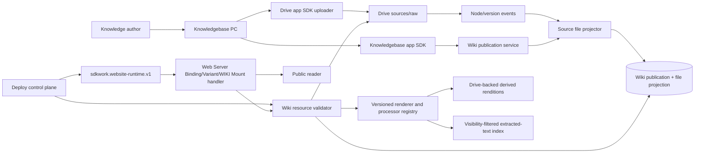

# ADR-20260721 Live Mounted Wiki Publication

Status: proposed
Requirement: REQ-2026-0721
Owner: SDKWork Knowledgebase maintainers
Date: 2026-07-21
Machine contract: `specs/live-wiki-publication.spec.json`
Specs: ARCHITECTURE_DECISION_SPEC.md, DATABASE_SPEC.md, DRIVE_SPEC.md, API_SPEC.md,
SDK_SPEC.md, SECURITY_SPEC.md, PERFORMANCE_SPEC.md, DEPLOYMENT_SPEC.md, MIGRATION_SPEC.md,
MEDIA_RESOURCE_SPEC.md, SUPPLY_CHAIN_SECURITY_SPEC.md

Cross-repository decisions:

- [Deploy unified cloud site publishing control plane](../../../../sdkwork-deployments/docs/architecture/decisions/ADR-20260721-unified-cloud-site-publishing-control-plane.md)
- [Web Server compiled website runtime descriptor](../../../../sdkwork-web-server/docs/architecture/decisions/ADR-20260721-compiled-website-runtime-descriptor.md)

## Context

The accepted prelaunch design builds immutable `SiteRelease` artifacts from OKF concepts and copies
rendered pages/assets back to Drive. The revised product requirement is WYSIWYG: `sources/raw` is the
live Wiki source, large Markdown uploads become eligible quickly, and every source file retains its
own processing/publication/visibility state. Domains, client Variants, TLS, and runtime rollout must
be shared with Drive directory Sites rather than implemented inside Knowledgebase.

The source tree is not Markdown-only. It may contain PDF, Office documents, presentations,
spreadsheets, HTML, JavaScript and other source code, images, audio, video, fonts, archives, and
downloadable files. Treating them all as generic assets would produce an incomplete Wiki, while
executing uploaded active content on the Wiki origin would create an unacceptable security boundary.

Keeping both designs active would produce two publication authorities, two rollback meanings, and
conflicting APIs/tables/UI.

## Decision

1. A Knowledgebase remains backed by a Drive `knowledge_base` Space. It is never converted to a
   Drive Website Space.
2. Every Knowledgebase owns exactly one canonical `WikiPublication`, provisioned
   idempotently in `DRAFT`, `REVIEW_REQUIRED`, and `PRIVATE` defaults. No special Knowledgebase type
   or conversion is required. Only `publicationType=wiki` and `wikiStatus=ACTIVE` are publicly
   provider-eligible.
3. The fixed eligible source root is `sources/raw`. `okf/`, `output/`, `.sdkwork/`, governance, and
   internal index data are excluded by construction.
4. Add a `SourceFileProjection` for each relevant Drive node/version with source, publication,
   visibility, index, route, render, error, and public-version state.
5. Native pages, safe HTML, documents, presentations, spreadsheets, source code, media, archives,
   and allowed static assets are resolved live through a typed `KNOWLEDGEBASE_WIKI` provider.
   Knowledgebase owns state, route, processor/rendition policy, render, navigation, search,
   redirect, SEO, and asset eligibility; Web Server owns HTTP/cache/stream execution.
6. Upload, processing, publish, republish, unpublish, visibility, route-content mapping, theme,
   renderer, navigation, search, quarantine, delete, and restore do not create `kb_site_release`,
   Deploy Release, Deployment, or SiteRevision. They advance public content versions or resource
   generations and emit events that invalidate/revalidate content representations.
7. Last-public-version policy is explicit. Security/private/delete/quarantine transitions always
   revoke stale public eligibility.
8. Deploy owns Site, resource, Variant, Mount, Binding, domain, TLS, descriptor revision, rollout,
   public request analytics, and delivery usage. Knowledgebase stores only stable Deploy connection
   references needed for integration, not duplicate host/certificate state.
9. Cloud and standalone delivery both use Web Server's compiled descriptor, WIKI handler, and typed
   provider adapter. Standalone may compose the provider in-process, but Knowledgebase exposes no
   anonymous fixed public route and does not own a second routing model.
10. `ADR-20260721-drive-backed-knowledgebase-site-publication` and its REQ/PLAN/MIG chain are
    superseded. Their prelaunch implementation was removed as the Phase 0 clean break and must remain
    absent; no compatibility route, schema, SDK alias, dual read, dual write, or rollback target is
    retained.
11. Add a versioned processor registry and rebuildable `SourceFileRendition` model. Native text,
    safe HTML, PDF, office, presentation, spreadsheet, source-code, media, archive, and unsupported
    binary profiles have explicit view, search, download, conversion, and security behavior.
12. Conversion runs in an isolated worker or approved converter service with bounded resources and
    no ambient credentials or private-network access. Generated renditions are written through the
    Drive server-side uploader and keyed by source version plus processor version; they are not
    SiteRelease artifacts or source authority.
13. Standard Wiki delivery never executes uploaded JavaScript, active HTML, service workers,
    WebAssembly, macros, formulas, or arbitrary CSS. A future trusted-active-site profile requires a
    separate isolated origin, signed artifacts, supply-chain evidence, and explicit security review.
14. Author-immediate/public-gated is the standard default. Upload completion immediately updates the
    authenticated source workspace, but public visibility requires an explicit version-fenced
    publish command after all checks. Owner-approved auto-public and scheduled workflows invoke the
    same command and gates with attributed actors. For updates, the previous verified public version
    remains active by default until explicit republish or an approved auto-public switch.
15. The descriptor contract is Deploy-owned `sdkwork.website-runtime.v1`. Its `resourceUuid` is the
    Deploy Site Resource identity; `providerResourceUuid` is the Knowledgebase `WikiPublication`
    identity. The descriptor also carries the stable provider Space/root references, required
    provider contract version, and bounded capabilities, but no endpoint, token, storage topology,
    credential, or presigned URL.
16. Web Server selects Binding, Variant, and longest-prefix WIKI Mount before calling the unified
    provider port. Knowledgebase maps its provider methods to `validateResource`,
    `resolveWikiRoute`, `openContent`, `searchWiki`, and `subscribeResourceEvents`; runtime context
    is authenticated and tenant/resource scoped, never derived from public request headers.
17. Only Deploy-owned Site composition or delivery/security/observability policy changes create a
    `SiteRevision`. Wiki upload, processing, publish, visibility, theme, renderer, navigation,
    search, quarantine, and delete advance provider content versions or resource generations and
    emit provider events without creating Deploy Release, Deployment, or `SiteRevision`.
18. Web Server cache identity includes Site revision policy generation, tenant scope, Binding,
    Variant, Mount, Deploy resource, provider resource generation, normalized Wiki route, public
    content version, renderer/theme/locale, and encoding. Provider events are idempotent freshness
    signals; authenticated provider revalidation remains the correctness authority after gaps.
19. One WikiPublication may be referenced by multiple authorized Deploy Site Resources, Sites,
    Variants, Mounts, and domains. Deploy owns those connections; Knowledgebase does not clone the
    publication or persist a singular Site/domain authority.

## Architecture

## Alternatives

- Keep immutable SiteRelease builds: rejected because it conflicts with live `sources/raw`, adds
  duplicate artifacts and build latency, and makes per-file state indirect.
- Serve Drive Markdown as static bytes: rejected because page state, rendering, search, navigation,
  routes, redirects, and privacy are Knowledgebase semantics.
- Make Drive Website Space the Wiki project: rejected because Knowledgebase already owns a distinct
  `knowledge_base` Space profile and knowledge lifecycle.
- Let Web Server infer public files from Drive: rejected because Drive does not own Wiki publication
  state or visibility semantics.
- Let Knowledgebase own domains/TLS: rejected because the shared Deploy control plane must prevent
  conflict and provide one commercial/operational model.

## Consequences

- Prelaunch `kb_site`, `kb_site_release`, and `kb_site_host_binding` contracts/code/generated SDKs
  require migration before launch; user changes implementing them are not silently deleted.
- Projection, renderer, navigation, search, event, and provider service become critical production
  boundaries with rebuild and compatibility contracts.
- Content rollback uses Drive/Knowledgebase version/public-state operations, while Site configuration
  rollback remains Deploy-owned.
- Deploy and Knowledgebase resource UUIDs remain distinct, so runtime routing/observations cannot be
  confused with provider aggregate identity.
- Provider event gaps degrade freshness trust for only the affected resource generation; they do not
  authorize broad cache reuse or force an unrelated Site descriptor rollback.
- Live origin availability/cache freshness become SLO inputs and require last-known-good public
  representation policy.
- Active user scripts/raw HTML remain blocked by default despite static-asset upload support.
- Processor upgrades and document converters become supply-chain and availability boundaries with
  canary, sandbox, version, timeout, output-validation, cleanup, and rollback requirements.

## Verification

- state, route, render, search, asset, event, provider, and dual-engine contract tests;
- no-release assertions for ordinary content/publication changes;
- reserved-root, traversal, sanitize, SSRF, tenant/cache/index isolation tests;
- event gap/rebuild/freshness/provider outage and last-public-version tests;
- full format-matrix, rendition, converter sandbox, extracted-text search, and active-content tests;
- generated SDK/dependency boundary and user/admin UI E2E;
- Deploy descriptor reference and SiteRevision-trigger contract tests;
- Web Server provider-port, error mapping, complete cache key, event checkpoint/gap, and
  last-known-good isolation contract tests;
- migration and old-authority absence checks.

## Supersedes / Superseded By

Supersedes `ADR-20260721-drive-backed-knowledgebase-site-publication` in full upon approval. The old
record remains in history and is marked superseded.
