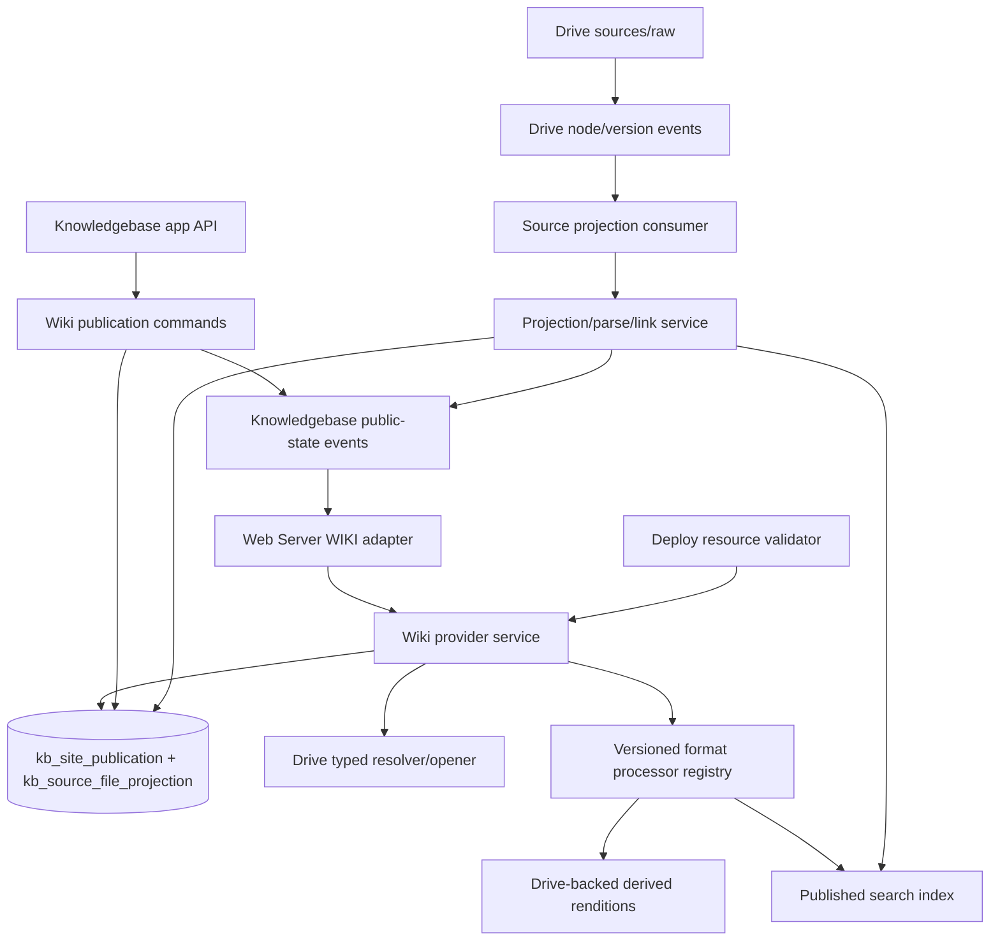
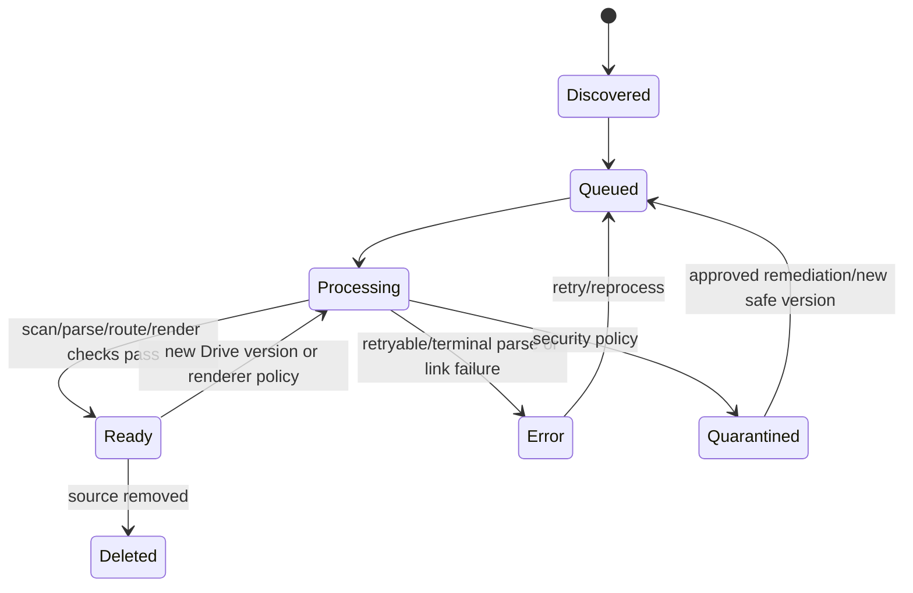

# Live Wiki Resource Provider Architecture

Status: proposed
Owner: SDKWork Knowledgebase maintainers
Updated: 2026-07-21
Requirement: REQ-2026-0721
Decision: ADR-20260721-live-mounted-wiki-publication
Machine contract: `specs/live-wiki-publication.spec.json`
Specs: ARCHITECTURE_DECISION_SPEC.md, DATABASE_SPEC.md, DRIVE_SPEC.md, API_SPEC.md,
SDK_SPEC.md, APP_SDK_INTEGRATION_SPEC.md, SECURITY_SPEC.md, PRIVACY_SPEC.md,
PERFORMANCE_SPEC.md, OBSERVABILITY_SPEC.md, TEST_SPEC.md, MIGRATION_SPEC.md,
MEDIA_RESOURCE_SPEC.md, SUPPLY_CHAIN_SECURITY_SPEC.md

Cross-repository authority:

- Deploy control plane: [TECH-cloud-site-publishing-control-plane.md](../../../../sdkwork-deployments/docs/architecture/tech/TECH-cloud-site-publishing-control-plane.md)
- Deploy decision: [ADR-20260721-unified-cloud-site-publishing-control-plane.md](../../../../sdkwork-deployments/docs/architecture/decisions/ADR-20260721-unified-cloud-site-publishing-control-plane.md)
- Web Server data plane: [TECH-cloud-site-delivery-data-plane.md](../../../../sdkwork-web-server/docs/architecture/tech/TECH-cloud-site-delivery-data-plane.md)
- Web Server decision: [ADR-20260721-compiled-website-runtime-descriptor.md](../../../../sdkwork-web-server/docs/architecture/decisions/ADR-20260721-compiled-website-runtime-descriptor.md)

## 1. Boundary And Source Of Truth

| Concern | Authority |
| --- | --- |
| Source bytes/nodes/versions/uploads | Drive `knowledge_base` Space and `sources/raw` folder |
| Wiki enablement and per-file semantic/public state | Knowledgebase `kb_*` |
| Render/navigation/search/route/asset eligibility | Knowledgebase provider service |
| Site/domain/path/Variant/TLS/config revision | Deploy `deploy_*` |
| HTTP/TLS/cache/stream execution | Web Server data plane |
| Identity/roles/permissions | IAM/application permission authority |
| Pricing/invoice/payment | Commerce; source modules emit attributable usage facts |

Knowledgebase does not write Drive or Deploy tables. It consumes their owner-generated SDKs or
approved typed Rust service ports. Web Server does not read the Knowledgebase database directly.

## 2. Runtime Components



The projection and search index are derived and rebuildable. Wiki publication settings and explicit
file publication/visibility decisions are business authority and require backup/migration/audit.

### 2.1 Deploy Descriptor And Web Server Adapter Alignment

The cloud runtime contract is Deploy's `sdkwork.website-runtime.v1` descriptor. Knowledgebase does
not compile, distribute, activate, or roll back that descriptor. A valid Wiki request follows the
shared order: exact or approved wildcard Binding, longest Binding path prefix, deterministic
Variant, longest WIKI Mount prefix, then a normalized provider-relative Wiki route.

The descriptor identity fields are deliberately distinct:

| Field | Owner and meaning |
| --- | --- |
| `resourceUuid` | Deploy-owned `deploy_site_resource` UUID used by routing, cache keys and runtime observations |
| `providerType` | `KNOWLEDGEBASE_WIKI` |
| `providerResourceUuid` | Knowledgebase-owned `WikiPublication.uuid`; the provider aggregate identity |
| `providerSpaceUuid` | stable Drive `knowledge_base` Space UUID |
| `providerRootNodeUuid` | last validated `sources/raw` root UUID; confinement evidence, not provider identity |
| `requiredProviderContractVersion` | compatibility fence between Deploy, Web Server and Knowledgebase |
| capability flags | bounded non-secret provider capability snapshot |

The descriptor never contains a provider URL, SDK base URL, token, bucket, object key, presigned
URL, database connection, or Drive credential. Bootstrap resolves the provider endpoint and service
identity outside the descriptor and injects the typed adapter.

Deploy creates a `SiteRevision` only when Deploy-owned Site, Resource, Variant, Mount, Binding,
delivery, security, limit, or observability configuration changes. Upload, processing, publish,
republish, unpublish, visibility, route content mapping, theme, renderer, navigation, search,
quarantine, and delete are provider lifecycle changes. They advance Knowledgebase public content
versions or resource generations and emit provider events; they do not create a Deploy Release,
Deployment, or `SiteRevision`. TLS snapshots also advance independently.

## 3. Target Database Contract

This is the planned portable contract. Executable PostgreSQL/SQLite migrations, RLS, and generated
models require separate human review. Standard SDKWork ID, UUID, tenant/organization, audit,
lifecycle, optimistic version, and UTC time rules apply.

### 3.1 `kb_site_publication`

Exactly one row per Knowledgebase Space. Creation is part of Knowledgebase provisioning as
an idempotent transaction/outbox workflow with DRAFT, REVIEW_REQUIRED, and PRIVATE defaults. Existing
eligible Knowledgebases receive the same canonical row through a bounded idempotent backfill before
the feature is enabled.

| Column | Contract |
| --- | --- |
| `space_id` | unique FK to `kb_space` |
| `drive_space_uuid` | stable Drive knowledge_base Space UUID |
| `source_root_node_uuid` | fixed `sources/raw` folder UUID |
| `publication_type` | `wiki` |
| `wiki_status` | `DRAFT`, `VALIDATING`, `READY`, `ACTIVE`, `DEGRADED`, `PAUSED`, `ARCHIVED`, `FAILED` |
| `title`, `description` | bounded Wiki identity metadata |
| `homepage_source_path` | nullable normalized path; default `index.md` |
| `default_locale`, `supported_locales_json` | bounded locale policy |
| `publication_mode` | `REVIEW_REQUIRED` or `AUTO_PUBLIC_AFTER_CHECKS` |
| `default_visibility` | `PRIVATE`, `UNLISTED`, or `PUBLIC`; public requires elevated validation |
| `update_policy` | `KEEP_LAST_PUBLIC_UNTIL_READY` or `UNPUBLISH_DURING_PROCESSING` |
| `navigation_mode` | `DIRECTORY`, `FRONT_MATTER`, `CURATED` |
| `navigation_config_json` | bounded settings/ordering references, no copied content |
| `theme_key`, `theme_version`, `theme_config_json` | approved renderer/theme identity and safe tokens |
| `renderer_policy_version` | immutable policy identity used for cache/rebuild |
| `search_enabled`, `robots_policy`, `sitemap_enabled` | public experience policy |
| `provider_generation` | provider-wide eligibility/root/renderer/theme/route-policy fence; ordinary page bodies do not advance it |
| `last_projected_drive_checkpoint` | rebuild/reconciliation observation |
| `activated_at`, `paused_at`, `last_error_code` | state evidence |

Unique `(tenant_id, space_id)` and `(tenant_id, uuid)`. Checks enforce one canonical publication,
wiki type, valid state/policy, bounded JSON, and `source_root_node_uuid` presence before READY.
Provision retries resolve the existing row and never create a second UUID. Deployment Site Resource,
Site, Mount, domain, certificate, and current SiteRevision do not belong here because one
WikiPublication may be reused by multiple Deploy connections. Connected-Site summaries are queried
through the Deploy SDK or maintained only as explicitly rebuildable observations.

### 3.2 `kb_source_file_projection`

| Column | Contract |
| --- | --- |
| `site_publication_id`, `space_id` | owning Wiki/Knowledgebase scope |
| `drive_space_uuid`, `drive_node_uuid`, `drive_version_uuid` | stable current source identity |
| `source_path` | normalized path relative to `sources/raw` |
| `canonical_route` | nullable until valid; required for every public page-capable source |
| `file_kind` | `PAGE`, `DOCUMENT`, `PRESENTATION`, `SPREADSHEET`, `CODE`, `MEDIA`, `ASSET`, or `ARCHIVE` |
| `media_type`, `size_bytes`, `content_sha256` | bounded source observations |
| `source_state` | `DISCOVERED`, `QUEUED`, `PROCESSING`, `READY`, `ERROR`, `QUARANTINED`, `DELETED` |
| `publication_state` | `DRAFT`, `IN_REVIEW`, `SCHEDULED`, `PUBLISHED`, `UNPUBLISHED`, `ARCHIVED` |
| `visibility` | `PRIVATE`, `UNLISTED`, `PUBLIC` |
| `index_state` | `NOT_REQUIRED`, `PENDING`, `INDEXING`, `READY`, `ERROR` |
| `title`, `description`, `locale` | extracted/curated bounded metadata |
| `nav_order`, `nav_hidden` | navigation projection |
| `scheduled_publish_at`, `published_at`, `unpublished_at` | lifecycle |
| `public_drive_version_uuid` | last verified public version used by update policy |
| `page_public_version` | monotonic/hash identity for this route's public representation or revocation fence |
| `parser_version`, `renderer_policy_version`, `index_version` | derived compatibility identities |
| `previous_canonical_route` | optional redirect source after accepted move |
| `redirect_status`, `redirect_expires_at` | bounded redirect lifecycle |
| `last_error_code`, `last_error_summary` | bounded/redacted author diagnostics |
| `last_processed_at`, `last_indexed_at` | freshness observations |

Unique active `(site_publication_id, drive_node_uuid)` and source path. Public canonical route is
unique within a publication for eligible rows. Indexes support tenant/publication/state/path/updated
lists, public route lookup, scheduled publication, projection retry, index work, and problems.

This table is a mixed projection/business state: Drive identity/content observations and parse/index
outputs are rebuildable; explicit publication/visibility/schedule/navigation decisions are retained
as Knowledgebase authority and reattached during rebuild by stable node identity. The implementation
must make this distinction explicit in backup/rebuild code.

### 3.3 `kb_source_file_rendition`

Generated previews and extracted representations are derived, rebuildable presentation state:

| Column | Contract |
| --- | --- |
| `source_file_projection_id` | owning source projection |
| `drive_version_uuid`, `source_content_sha256` | exact source version and checksum |
| `processor_id`, `processor_version`, `policy_version` | reproducible processing identity |
| `rendition_kind` | `SANITIZED_HTML`, `PDF`, `PAGE_IMAGE`, `THUMBNAIL`, `POSTER`, `PLAIN_TEXT`, `SLIDE_TEXT`, `SHEET_PREVIEW`, `ARCHIVE_MANIFEST`, or `MEDIA_METADATA` |
| `rendition_state` | `PENDING`, `PROCESSING`, `READY`, `ERROR`, `QUARANTINED`, or `EXPIRED` |
| `rendition_drive_space_uuid`, `rendition_drive_node_uuid`, `rendition_drive_version_uuid` | stable Drive identity for generated bytes |
| `media_resource_snapshot` | optional canonical `MediaResource` read-model snapshot |
| `content_sha256`, `media_type`, `size_bytes` | verified output identity and bounds |
| `page_or_slide_count`, `width`, `height`, `duration_millis` | bounded type-specific metadata |
| `error_code`, `error_summary`, `processed_at`, `expires_at` | redacted processing and cleanup state |

Unique rendition identity includes tenant, source Drive version, processor id/version, policy
version, rendition kind, and content checksum. Generated bytes are written through
`sdkwork-drive-uploader-service`; Knowledgebase never stores object keys. Renditions are not
SiteRelease artifacts and never replace source bytes as authority.

### 3.4 Existing `kb_document` And Index Tables

`kb_document`/versions/chunks/index/embeddings continue to own knowledge ingest and retrieval. The
source projection may reference a document UUID/ID when a supported source is ingested, but public
Wiki route/state must not be inferred from a RAG index row. Public search indexes only eligible public
versions and has an independent visibility filter.

### 3.5 Retired Prelaunch Tables

`kb_site`, `kb_site_release`, and `kb_site_host_binding` from the unlaunched release-oriented design
were removed in Phase 0. They are forbidden in the target baseline; the migration plan preserves
zero presence and does not define a transform, compatibility view, dual read, or dual write.

## 4. Projection Pipeline



Processing steps:

1. Validate event schema/checkpoint, tenant, Knowledgebase Drive binding, and `sources/raw` ancestry.
2. Upsert by stable Drive node identity and source version with idempotency/fencing.
   An ordinary edit keeps `drive_node_uuid`, creates a new immutable `drive_version_uuid`, and may
   update the normalized path. Rejecting a new version because its logical path exists is invalid.
3. Obtain bounded metadata/content only through Drive SDK/service port.
4. Classify format from normalized extension, declared MIME, detected signature, checksum, and scan
   state; mismatch blocks public readiness.
5. Resolve one versioned processor profile. Parse native text in-process only when bounded and safe;
   route document, presentation, spreadsheet, media, OCR, transcript, and archive work to an
   isolated processor.
6. Generate required renditions and extracted text through the Drive server-side uploader, then
   verify output MIME, signature, checksum, size, page/slide/sheet count, and policy.
7. Derive canonical route, locale, title, document outline, links, assets, headings, navigation, and
   search metadata.
8. Validate path/route collisions, reserved names, sanitizer/converter output, external URL policy,
   active-content policy, and asset references.
9. Update projection, rendition, and public-version eligibility transactionally with an outbox
   event.
10. Queue/update/remove the public search index using the same eligible source and rendition version.

Workers use durable leases/fencing, bounded batches/concurrency/deadlines, idempotency, retry with
jitter, dead-letter/problem state, and checkpoint reconciliation. No step holds whole large source
trees in memory.

## 5. Publication State Transitions

Commands are explicit and permissioned:

```text
DRAFT -> IN_REVIEW -> PUBLISHED
DRAFT/IN_REVIEW -> SCHEDULED -> PUBLISHED
PUBLISHED -> UNPUBLISHED
UNPUBLISHED -> DRAFT/IN_REVIEW/PUBLISHED
any non-deleted -> ARCHIVED
```

Author and public visibility are separate contracts:

```text
upload commit
  -> author-visible source row
  -> processing and private preview
  -> awaiting publish
  -> explicit/automatic/scheduled publish command
  -> atomic public-version switch
```

The default is `REVIEW_REQUIRED`: upload and preview never change anonymous delivery. For a first
version, readiness produces `AWAITING_PUBLISH`. For an update to an already public file,
`KEEP_LAST_PUBLIC_UNTIL_READY` retains the old verified public version and readiness produces
`UPDATE_AWAITING_PUBLISH`; only explicit republish switches it. `UNPUBLISH_DURING_PROCESSING`
removes the public representation while the new version is processed.

Publication requires source READY, visibility PUBLIC/UNLISTED, a valid unique page/asset route,
allowed asset and rendition policy, processor/renderer compatibility, no blocking problems, and
expected version. Search
readiness may be required by publication policy; otherwise the page can publish with search pending
and clear UI/telemetry.

Auto-public executes the same command/gates with a system actor attributed to the owner-approved
policy. It does not bypass permission, scan, route, render, or visibility checks. Scheduled jobs
revalidate source/policy/version at execution time.

Bulk publication is a bounded command over explicit source projection ids and expected versions. It
returns per-item outcomes, publishes only items that satisfy every gate, and never interprets a
partial failure as full success. Upload path, filename, embedded metadata, or uploader identity
cannot implicitly enable auto-public.

## 6. Provider Service Contract

The split-topology contract is owned by `sdkwork-knowledgebase-internal-api` and generated as
`sdkwork-knowledgebase-internal-sdk`. Standalone topology injects an equivalent typed Rust service
port. Deploy and Web Server must declare this SDK/service dependency; raw HTTP, manual auth headers,
direct Knowledgebase database access, and an anonymous Knowledgebase public router are forbidden.

The Web Server owns a unified provider port. Knowledgebase owns the final Wiki service method names
and supplies this compatibility mapping:

```text
validateResource(reference, runtimeContext)
  -> validateWikiResource(reference.providerResourceUuid, runtimeContext)
  -> eligibility, source root, provider generation, capabilities

resolveWikiRoute(reference, normalizedRoute, locale, conditions, runtimeContext)
  -> resolveWikiRoute(reference.providerResourceUuid, normalizedRoute, locale, conditions, runtimeContext)
  -> NOT_FOUND | REDIRECT | NOT_MODIFIED | PAGE(public representation)

openContent(reference, representation, range, conditions, runtimeContext)
  -> openWikiAsset or openWikiRendition for an exact pinned public representation
  -> NOT_FOUND | NOT_MODIFIED | bounded metadata + stream

searchWiki(reference, query, cursor, pageSize, locale, runtimeContext)
  -> searchWiki(reference.providerResourceUuid, query, cursor, pageSize, locale, runtimeContext)
  -> bounded versioned result

subscribeResourceEvents(reference, checkpoint, runtimeContext)
  -> subscribeWikiResourceEvents(reference.providerResourceUuid, checkpoint, runtimeContext)
  -> idempotent versioned events plus durable checkpoint

Wiki extension: getWikiNavigation(reference.providerResourceUuid, locale, version, runtimeContext)
```

Runtime context contains authenticated service identity, tenant/resource scope,
`providerResourceUuid`, purpose, trace, and deadline. It never accepts tenant identity from a public
header. The provider authorizes before existence-sensitive lookup. Provider errors distinguish
not-found/not-public, not-modified, invalid path, revoked resource, rate limit, transient
unavailable, and contract mismatch internally while public responses remain non-disclosing.

### 6.1 Page Representation

The provider returns canonical route/URL components, title/description/locale, a typed page,
document, presentation, spreadsheet, source-code, or media representation, headings/document
outline/slide or sheet navigation, breadcrumbs, updated/public times, source/public/processor/render
versions, SEO/robots metadata, ETag/modified source, and safe rendition/asset references. It never
returns private source bytes unless a separately authorized API requests them.

### 6.2 Asset Representation

Asset open verifies the asset projection is READY/PUBLISHED/PUBLIC-or-UNLISTED and matches the
requested public version. It delegates the pinned Drive version stream. MIME/disposition candidates
are safe metadata; Web Server applies final delivery policy. Private assets referenced by public
pages remain not found and appear in author problems.

### 6.3 Navigation And Search

Navigation is a versioned projection derived from eligible public files plus curated settings.
UNLISTED and `navHidden` items are absent. Search indexes only eligible public pages and always
filters tenant/publication/public version at query time. Results are bounded and cursor/page
paginated in the store/index, not sliced after full collection.

## 7. Multi-Format Processor And Static Asset Policy

The processor registry selects exactly one profile from detected format and configured policy:

| Profile | Processing and public representation |
| --- | --- |
| Native page | Versioned CommonMark/text parser. MDX is treated as Markdown with JSX/components disabled. |
| Safe HTML | Parse DOM, strip active content, rewrite eligible local links/assets, and sanitize to an allowlisted profile. |
| PDF/document | Serve pinned safe PDF when allowed; extract bounded page text and thumbnails. DOC/DOCX/ODT/RTF/EPUB use an isolated converter for PDF, page image, text, and outline renditions. |
| Presentation | PPT/PPTX/ODP/KEY use an isolated converter for slide-image/PDF renditions plus bounded slide text and approved notes. |
| Spreadsheet | XLS/XLSX/ODS/CSV/TSV produce a bounded read-only sheet preview and extracted text. Formulas are never evaluated by the Wiki runtime. |
| Source code | JS/TS/CSS/JSON/YAML/XML/TOML/SQL and approved programming languages render as escaped syntax-highlighted text with line anchors; they never execute. |
| Media | Images, audio, and video use approved viewers with Drive-backed thumbnail/poster/metadata/transcript renditions and bounded range delivery. |
| Archive | ZIP/TAR/GZ/7Z/RAR are attachment-only with an optional bounded safe member manifest; archive members never render implicitly. |
| Unsupported binary | Executables, libraries, installers, signature mismatch, or unknown dangerous content are quarantined or explicitly attachment-only. |

Processor contracts declare id/version, MIME and extension set, signature rules, input/output size,
page/slide/sheet/member limits, sandbox profile, network policy, timeout, concurrency, temporary
storage, output renditions, and extraction behavior. Document conversion runs without ambient
credentials or private-network access, with read-only input, bounded temporary storage, process
isolation, macro/active-content blocking, decompression-ratio checks, and verified output.

Metadata resolution uses explicit Knowledgebase projection overrides first, then validated native
front matter, sanitized embedded PDF/Office/media metadata, and normalized filename fallback.
Title, description, route, locale, navigation, alt text, and download label may be curated without
rewriting the binary source. Embedded metadata can never elevate publication, visibility,
permission, scan, or execution state.

Rendition identity includes source version/checksum, processor id/version, policy version, locale,
kind, and output checksum. Processor upgrades use shadow validation, bounded reprocessing, canary,
compatibility evidence, rollback, and Drive-owned cleanup. A conversion failure cannot replace the
last verified public version unless the configured update policy explicitly unpublishes it.

Default public assets include safe images, favicon, audio/video, downloadable documents, text/data,
fonts, and approved styles subject to MIME, disposition, scan, CSP, and range policy. Uploaded
JavaScript, active HTML, active SVG, iframe/embed, service worker, WebAssembly, macros, formulas, and
arbitrary CSS never execute on the standard Wiki origin. Supporting a file as source, preview, or
download is not permission to execute it.

A future trusted-active-site profile requires a separate isolated origin, no shared SDKWork
credentials, signed versioned packages, dependency inventory, SBOM/provenance, vulnerability
review, strict CSP, release rollout/rollback evidence, and explicit security approval. Theme
packages follow the same governed supply-chain boundary; user theme config is bounded data, not an
executable template.

## 8. Route, Link, And Redirect Rules

- source path and route are normalized once using canonical/raw dual representation;
- one processor-declared page extension is removed and directory/index mapping is deterministic;
- a page-capable file such as `manual.pdf` receives an extensionless Wiki wrapper route while its
  pinned original download remains a separate policy-checked provider representation;
- multiple source files that normalize to one canonical route block readiness until an explicit
  reviewed route override resolves the conflict;
- route uniqueness is enforced by canonical comparison including locale policy;
- old-route redirect is created only on accepted move/rename and points to a stable target route;
- redirect chains/cycles and external/open redirects are rejected;
- relative links are rewritten to canonical Wiki routes only when their target is eligible;
- unresolved/private links are author problems and do not reveal the target to public readers;
- external links receive safe rel/referrer behavior and optional warning policy;
- asset paths cannot leave `sources/raw` through encoding, relative traversal, shortcuts, or Drive
  identifiers.

## 9. Event And Cache Consistency

Drive must publish an accepted AsyncAPI change stream containing
`drive.node.version.committed.v1`, `drive.node.path.changed.v1`,
`drive.node.eligibility.changed.v1`, and `drive.node.deleted.v1`. Knowledgebase consumes it with a
durable checkpoint scoped by tenant, Drive Space, and `sources/raw` binding. Delivery is
at-least-once; consumers fence by event, stable node, version and checkpoint, and repair gaps with a
bounded root reconciliation.

Knowledgebase atomically commits public state plus one of
`knowledgebase.wiki.provider.changed.v1`, `knowledgebase.wiki.route.changed.v1`,
`knowledgebase.wiki.route.revoked.v1`, `knowledgebase.wiki.navigation.changed.v1`, or
`knowledgebase.wiki.search.changed.v1`. Events contain provider identity, provider generation,
affected normalized routes, page public versions, operation, checkpoint, reason and time, not
bodies or storage topology. A move invalidates both old and new routes. Web Server consumes provider
events directly; Deploy compiles configuration and is not in the content-update hot path.

Generation domains are independent:

- Drive source checkpoint tracks projection progress and is never a public cache key;
- provider generation changes only for provider-wide eligibility/root/policy transitions;
- page public version changes for one route's publish, update or revocation;
- navigation and search generations version their own snapshots;
- SiteRevision policy generation remains Deploy-owned configuration state.

Private upload/projection/preview work advances none of the public versions. An ordinary page-body
update invalidates only affected routes and required navigation/search snapshots; it must not flush
the full Wiki.

Public-to-private/unpublish/delete/quarantine has priority. A transaction updates business state and
appends the event. Web Server cache identity is the complete cross-repository tuple:

```text
siteRevisionPolicyGeneration
+ tenantScopeHash
+ bindingUuid + variantUuid + mountUuid
+ resourceUuid + providerGeneration
+ normalizedProviderPathOrWikiRoute
+ pagePublicVersion
+ rendererPolicyVersion + themeVersion + locale + representationEncoding
```

Raw host/path or Knowledgebase publication/route alone is never a cross-tenant cache key. On a
sequence gap, incompatible version, checkpoint loss, or excessive lag, Web Server marks the Deploy
provider generation uncertain, stops trusting freshness-only cache, reconciles through provider
metadata, and resumes from a durable checkpoint. Events reduce freshness latency; authenticated
provider read-through validation remains the correctness backstop.

Freshness is measured from the committed explicit, automatic, or scheduled publish transition that
changes the eligible public version. Drive upload completion, processor completion, and private
preview readiness are authoring milestones and do not start the public freshness SLO.

## 10. API And SDK Integration

App API/SDK groups cover Wiki publication settings/status, source files/problems, review/publication
commands, schedules, navigation, route preview/redirects, renderer/SEO/search settings, and connected
Deploy Site and Site Resource summaries. Backend SDK covers publication fleet, projection/index
queues, renderer policy, rebuild/reprocess, quotas, provider health, and audit.

Bytes continue through Drive Uploader dependency SDK. Deploy Site/domain/TLS actions use the
declared Deploy app SDK/facade. All authenticated app/dependency SDKs share the application global
TokenManager through bootstrap injection. Backend-admin UI uses backend SDKs and does not call app
API. No raw HTTP/manual auth/local generated dependency fork is allowed.

Provider execution uses the Knowledgebase-owned internal API/generated SDK or equivalent standalone
service port, not an anonymous Knowledgebase
management or data endpoint. Both standalone and cloud traffic enter Web Server through an active
WebsiteRuntimeDescriptor Binding/Variant/WIKI Mount. Standalone composition may inject the same
typed Rust service in-process, but it does not create a Knowledgebase-owned `/wiki/...` route.

## 11. UI Package Boundaries

User-facing Knowledgebase packages own Wiki overview, Source Explorer, page/review workspace,
navigation, theme/SEO/search settings, problems, versions, and Knowledgebase quota. Connected
domain/TLS/analytics controls are SDK-backed summaries/deep links to Deploy.

Backend-admin packages own publication/projection/index/renderer/provider/usage/audit operations
through the generated Knowledgebase backend SDK. Large source/problem lists are store-paginated;
bulk actions use asynchronous command IDs/progress and bounded selections.

## 12. Security And Privacy

- tenant/organization/Space/publication predicates at API/service/store/index/cache/provider/event;
- verified dual-token/session context for management and service identity for provider resolution;
- Drive root ancestry and pinned version validation before content open;
- Markdown/front matter/HTML/URL/asset sanitizer, bounded render, and SSRF-safe external policy;
- private/draft/review comments/source Markdown/author identity/search index excluded from public;
- public non-disclosing not-found across nonexistent/private/wrong-tenant/paused/unready;
- secrets/object keys/presigned URLs/content omitted from logs/events/audit/metrics/support bundles;
- abuse/malware/phishing/takedown/legal-hold coordination with Drive/Deploy and auditable recovery;
- retention/export/delete and author attribution policy aligned with privacy/tenant settings.

## 13. Reliability, Rebuild, And Failure

| Failure | Behavior |
| --- | --- |
| Drive event duplicate/out-of-order | idempotent version/fencing; stale event cannot overwrite new |
| Event gap/checkpoint loss | bounded reconciliation scan from Drive, preserve explicit decisions |
| Parse/render/conversion failure | new source or rendition version ERROR; apply configured last-public-version policy |
| Processor timeout/crash/malformed output | fail closed, terminate sandbox, discard temporary output, retain only policy-allowed last verified public version |
| Quarantine/private/delete | immediate public revocation, no stale fallback |
| Search unavailable | page delivery follows policy; search degraded and observable |
| Provider/Drive unavailable | bounded timeout/circuit; Web Server may serve only allowed prior verified public cache |
| Renderer version rollout | shadow validate, bounded reprocess, canary, rollback policy version |
| Projection/index corruption | rebuild derived state from Drive and retained publication decisions |
| Deploy unavailable | content authoring continues; Site config operations fail explicitly; active runtime can serve |

Backup includes Wiki publication and explicit per-file decisions/schedules/routes plus audit. Drive
backup owns source bytes/versions. Search/navigation/render projections are rebuildable with version
evidence. Restore validates Drive binding/root and Deploy connection before marking ACTIVE.

## 14. Performance And Capacity

Limits cover projected files/publication, upload/project batches, event batches/lag, source bytes,
format signature detection, pages/slides/sheets/cells/archive members and expansion ratio, Markdown
nodes/depth, front matter, source-code lines, links/assets/headings, render/conversion
output/time/concurrency/temporary storage, navigation items, redirects, locales, search
query/page-size/index bytes, renditions, problems, retained public versions, and background retries.
Product entitlements may be lower than safety ceilings.

Load tests include very large file counts, deep navigation, link-heavy pages, code/table/diagram
stress, large PDF/Office/presentation/spreadsheet conversion, archive bombs, many media renditions,
many assets, rapid edits/visibility flips, event storms/gaps, search rebuild, hot pages, cache
invalidation, Drive/processor/search slowdown, and multi-tenant skew. Lists/search paginate at
the store/index and processing streams rather than collecting all files.

## 15. Observability And Commercial Facts

Metrics/events cover publication/file states, projection/event/index lag, processing/render duration
and failure class, routes/conflicts/links/assets, public resolve/page/asset/search latency/results,
cache version/freshness observation, rebuild/retry/dead-letter, quota, and authorization. Raw paths,
titles, queries, and content stay out of metric labels.

Knowledgebase emits deduplicated usage facts for active Wiki time, projected/published files, index
bytes, processing/render/index operations, automation, locale/features, and retention. Drive and
Deploy meter their own storage and delivery dimensions. Attribution prevents double billing and
aggregates reconcile before commercial GA.

## 16. Migration And Rollout

1. Preserve the completed clean baseline: old release/host-binding APIs, tables, routes, code, SDK
   output, permissions, configuration, and UI remain absent.
2. Approve the new requirement/ADR/database/API/state/permission vocabulary and confirm that no
   customer or production data existed in the removed prelaunch model.
3. Add Wiki publication/file projection through additive dual-engine migrations; provision one
   canonical DRAFT/PRIVATE WikiPublication for new Knowledgebases and backfill existing eligible
   Knowledgebases idempotently before exposure.
4. Implement Drive event projection, renderer/search, and typed provider behind feature flags.
   Drive input and Knowledgebase output AsyncAPI authorities plus component event inventories are a
   prerequisite, not follow-up documentation.
5. Regenerate Knowledgebase SDKs from owner OpenAPI and update UI through injected dependency SDKs.
6. Integrate Deploy resource and Web Server WIKI handler in a non-public shadow environment, then a
   bounded pilot; do not restore an old public router for comparison or rollback.
7. Run the shared descriptor-reference, provider-port, error, cache-key, event-gap, standalone/cloud,
   and last-known-good contract suites against Deploy and Web Server.
8. Certify isolation, freshness, load, backup/rebuild, domain/TLS, operations, and commercial gates.

Detailed sequencing and rollback are in the linked migration plan. Database changes require human
review and are not authorized by this document alone.

## 17. Verification Matrix

| Boundary | Evidence |
| --- | --- |
| Database | dual-engine schema/RLS/index/state/concurrency/migration/old-authority absence |
| Projection | Drive event duplicate/order/gap/rebuild, format classification, parse/link/asset, lease/fence/retry |
| Source updates | stable node/new immutable version, concurrent edits, rename/move, delete/restore, rollback, old/new route invalidation |
| Publication | permissions, state/visibility/schedule/auto/update/unpublish/restore |
| Provider | eligibility, route/page/asset/nav/search, typed context, non-disclosure |
| Deploy descriptor | resource/provider identity split, WIKI Mount compatibility, revision triggers, no secret topology |
| Web Server adapter | unified provider port/error mapping, full cache tuple, event checkpoint/gap, last-known-good isolation |
| Render/security | Markdown/HTML/PDF/Office/presentation/spreadsheet/code/media/archive matrix, sandbox, sanitizer, XSS, macros, archive bombs, active assets, URL/SSRF, bounds, reserved roots, tenant isolation |
| Cache/events | public-version keys, invalidation priority, uncertainty/revalidation, freshness |
| Realtime | author projection, native auto-public, explicit publish and priority revocation p95/p99 under event/cache load |
| SDK/UI | owner generation, Drive/Deploy dependency SDKs, user/admin state/permission E2E |
| Performance | large source, render/search/index/event load and soak with bounded resources |
| Operations | outage, backup/restore/rebuild, renderer rollout, abuse, audit, quota/reconciliation |
| No release | ordinary provider lifecycle changes create no KB SiteRelease, Deploy Release, Deployment, or SiteRevision |
